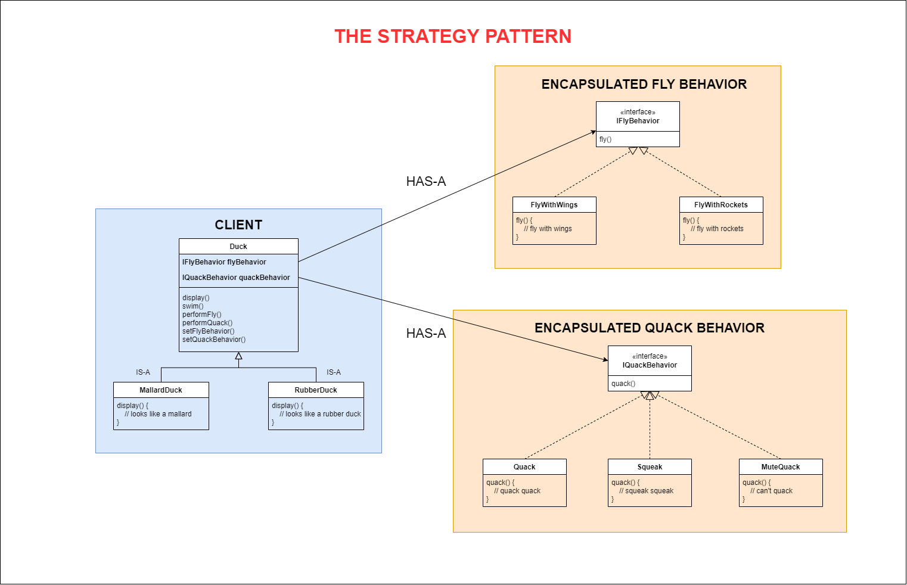

# THE STRATEGY PATTERN

## 1. The Problem
You are making a Duck Simulator application. Started, all of your ducks had only two behaviors: `swim` and `display`.

Currently, your customers want your ducks to be able to `fly` and `quack`. However, the `fly` behavior varies among your ducks:

- Some ducks typically fly with two wings.
- Some special ducks fly with many rockets.
- Some other ducks can not fly.

The same problem occurs with the `quack` behavior. How will you deal with it?

## 2. The Definition of Strategy Pattern

**The Strategy Pattern** defines a family of algorithms,
encapsulates each one, and makes them interchangeable.
Strategy lets the algorithm vary independently from
clients that use it.

## 3. Demo Diagram

