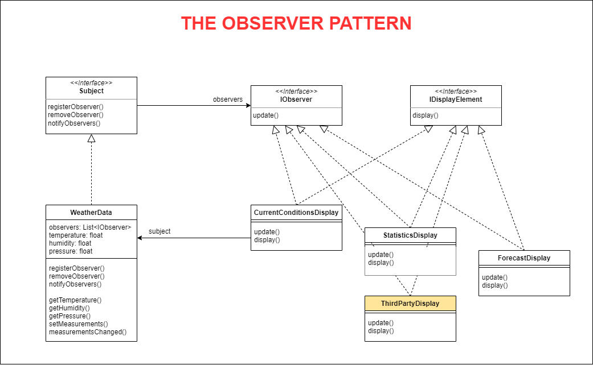

# THE OBSERVER PATTERN
## Keeping your Objects in the Know

## 1. The Problem

Your team has been selected to build a Weather Monitoring application for the Weather-O-Rama company.

Currently, Weather-O-Rama's developers provide your team with the `WeatherData` object, which talks to their physical Weather Station to get updated weather data: `temperature`, `humidity`, and `pressure`.

Based on the contract, your team needs to build three display elements to show on display devices:
- Current Conditions (show the weather data values).
- Weather Statistics.
- A simple Forecast.

Each display element gets weather data, calculating according to their business and delivering the result on devices.

The CEO of Weather-O-Rama also wants their application to expand quickly by **allowing other third parties to build their own displays**.

How will your team build this application? Don't forget that Weather-O-Rama's Weather Station may provide more types of weather data in the future.

## 2. The Definition of Observer Pattern
The Observer Pattern defines a one-to-many dependency between objects so that when one object changes state, all of its dependents are notified and updated automatically.

## 3. Demo Diagram

## 4. Makes use of OO Design Principles

(Head First Design Patterns, 2nd Edition, pages 54 and 75)

**Encapsulate what varies**

The thing that varies in the Observer Pattern is the **state** of the Subject and the **number** and **types** of Observers. With this pattern, you can vary the objects that are dependent on the state of the Subject, without having to change that Subject.

**Program to an interface, not an implementation**

Both the Subject and Observers use interfaces. The Subject keeps track of objects implementing the Observer interface, while the Observers register with, and get notified by, the Subject interface.

**Favor composition over inheritance**

The Observer Pattern uses composition to compose any number of Observers with their Subject. These relationships aren't set up by some kind of inheritance hierarchy. They are set up at runtime by composition.

**Strive for loosely coupled designs between objects that interact**

- The only thing the subject knows about an observer is that it implements a certain interface (the Observer interface).
- We can add new observers at any time.
- We never need to modify the subject to add new types of observers.
- We can reuse subjects or observers independently of each other.
- Changes to either the subject or an observer will not affect the other.