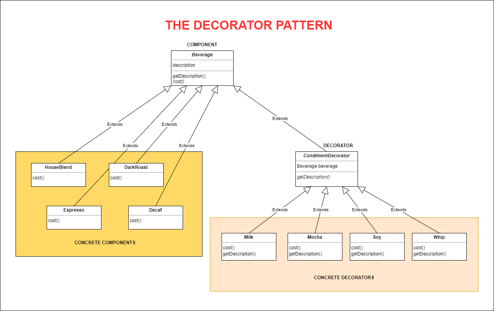

# THE DECORATOR PATTERN
## Decorating Objects

## 1. The Problem

The owner of Starbuzz Coffee needs to build an order system for his coffee store chain. According to his business, each coffee store serves lots of coffee types. They also provide many condiments used with each cup of coffee. Each order's total cost is based on which kind of coffee and how many condiments the customer orders. How will you build a system that meets his requirements?

## 2. The Definition of Decorator Pattern

**The Decorator Pattern** attaches additional responsibilities to an object dynamically. Decorators provide a flexible alternative to subclassing for extending functionality.

## 3. Demo Diagram

