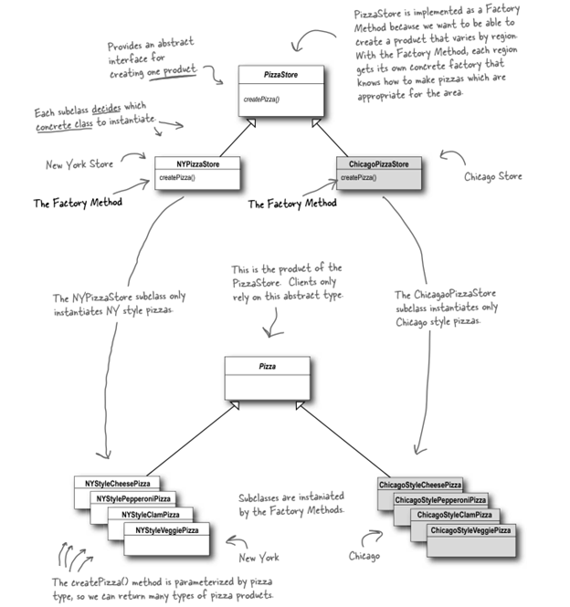

# THE FACTORY PATTERN
## Baking with OO Goodness
## 1. The Problem

You have a Pizza Store that sells many types of pizza, such as Cheese, Clam, etc. You want to open many branches in other regions to expand your business. The problem is that the people in each area have different tastes in pizza. For example, people in New York love pizza with thin-crust dough, marinara sauce, and Reggiano cheese, while others in Chicago love pizza with thick-crust dough, plum-tomato sauce, and Mozzarella cheese.

To solve this problem, you allow each regional branch to use different ingredients according to the neighborhood's taste. However, you want all branches to follow the original procedure of making a pizza:
- Bake for 25 minutes at 350.
- Cutting the pizza into diagonal slices.
- Place the pizza in the official PizzaStore box.

What will you do to make your plan come true?

## 2. Two Factory Patterns
### 2.1. The Factory Method Pattern

**The Factory Method Pattern** defines an interface for creating an object, but lets subclasses decide which class to instantiate. Factory Method lets a class defer instantiation to subclasses.

### 2.2. The Abstract Factory Pattern

**The Abstract Factory Pattern** provides an interface for creating families of related or dependent objects without specifying their concrete classes.

### 2.3. Factory Method and Abstract Factory compared

