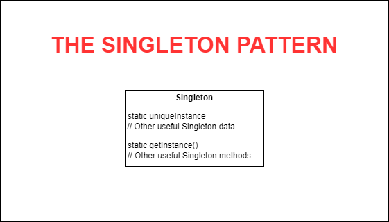

# THE SINGLETON PATTERN
## One-of-a-Kind Objects
## 1. The Definition of Singleton Pattern

**The Singleton Pattern** ensures a class has only one instance, and provides a global access point of access to it.

## 2. Demo Diagram

