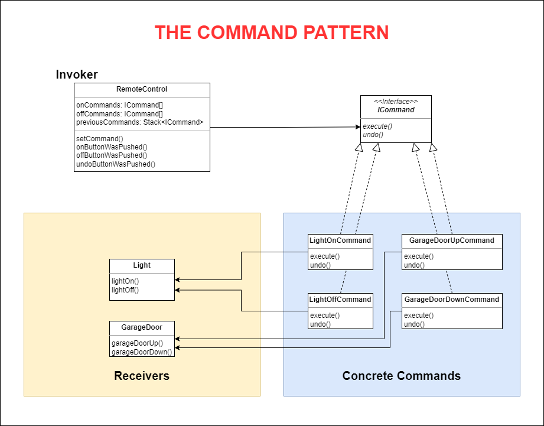

# THE COMMAND PATTERN
## Encapsulating Invocation
## 1. The Problem

Bill Thompson, CEO of Home Automation or Bust, Inc., wants you to design the API for their new Home Automation Remote Control.

The remote control features seven programmable slots (each can be assigned to a different household device) along with corresponding on/off buttons for each. It also has a global undo button.

Bill's company cooperates with many vendors providing Java classes to control home automation devices such as lights, fans, stereos, etc.

Your work is to create an API for programming the remote so that each slot can be assigned to control a device or set of devices. Note that the remote control must be able to handle any future devices that their vendors may supply.

## 2. The Definition of Command Pattern

**The Command Pattern** encapsulates a request as an object, thereby letting you parameterize other objects with different requests, queue or log requests, and support undoable operations.

## 3. Demo Diagram

