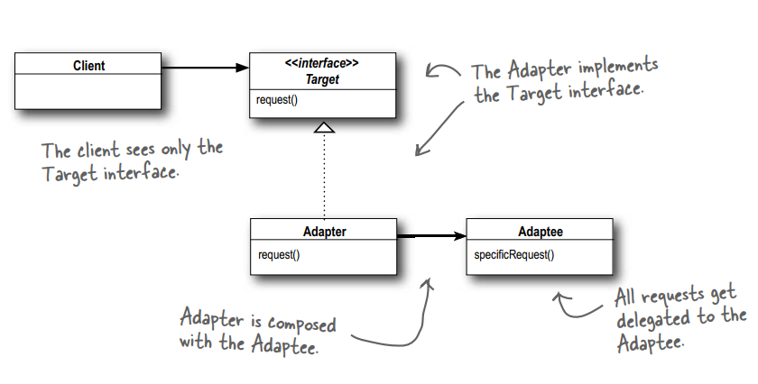
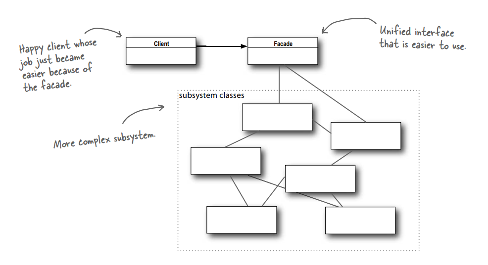
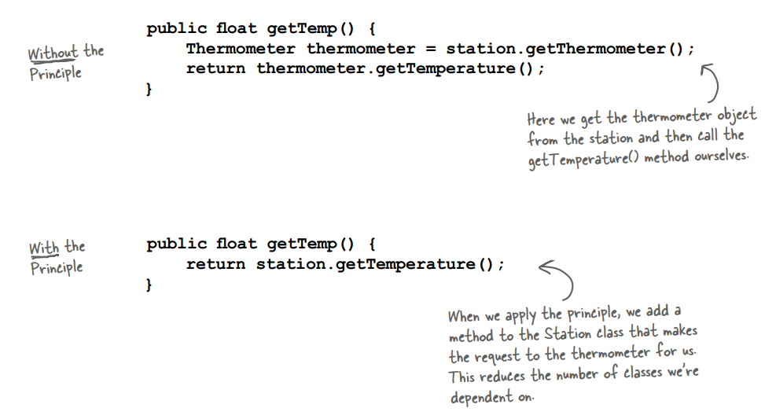
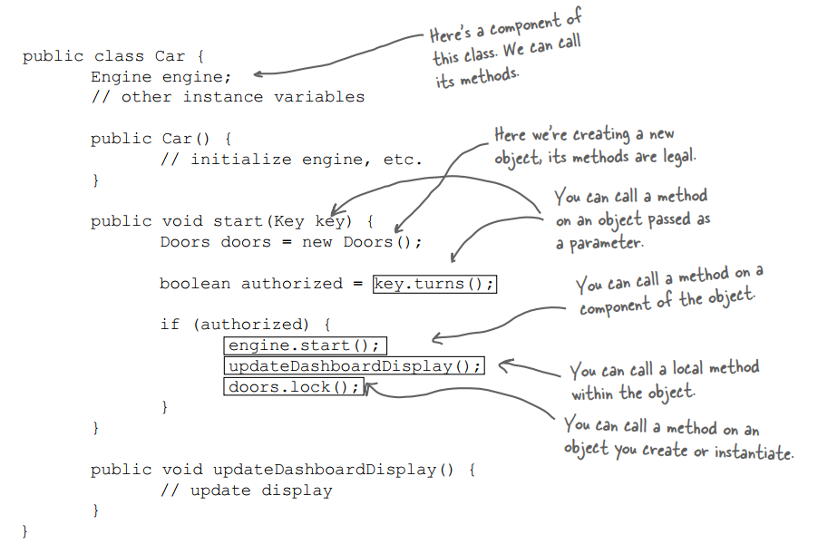

# THE ADAPTER AND FACADE PATTERNS
## Being Adaptive
## 1. The Adapter Pattern
### 1.1. Definition

**The Adapter Pattern** converts the interface of a class into another interface the clients expect. Adapter lets classes work together that couldn't otherwise because of incompatible interfaces.

### 1.2. Class Diagram

## 2. The Facade Pattern
### 2.1. Definition

**The Facade Pattern** provides a unified interface to a set of interfaces in a subsytem. Facade defines a higher-level interface that makes the subsystem easier to use.

### 2.2. Class Diagram

## 3. Demonstrates the "Principle of Least Knowledge"

