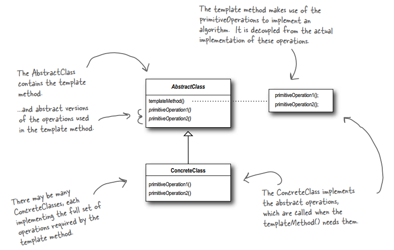
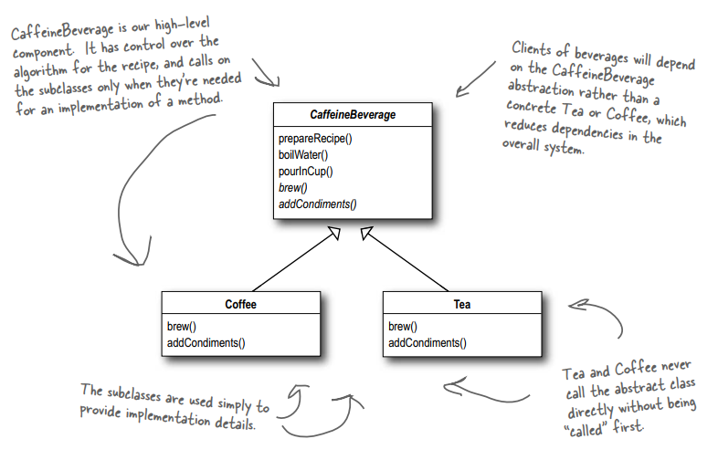

# THE TEMPLATE METHOD PATTERN
## Encapsulating Algorithms
## 1. The Problem

Starbuzz Coffee has a training manual for their baristas to prepare beverages for customers.

The Starbuzz Coffee Recipe includes these steps:
1. Boil some water
2. Brew coffee in boiling water
3. Pour coffee into a cup
4. Add sugar and milk.

The Starbuzz Tea Recipe includes these steps:
1. Boil some water
2. Steep tea in boiling water
3. Pour the tea into a cup
4. Add lemon

You need to write some code for creating coffee and tea. Note that the recipe for coffee looks a lot like the tea recipe. Moreover, some customers don't like sugar and milk in their cups of coffee, and others don't want any lemons in their cups of tea.

## 2. The Definition of Template Method Pattern

**The Template Method Pattern** defines the skeleton of an algorithm in a method, deferring some steps to subclasses. Template Method lets subclasses redefine certain steps of an algorithm without changing the algorithm’s structure.

## 3. Demo Diagram

## 4. Methods in the Template Method's Abstract Class

- The template method's abstract class may define **concrete methods**, **abstract methods** and **hooks**.
- **Abstract methods** are implemented by subclasses.
- **Hooks** are methods that do nothing or default behavior in the abstract class, but may be **overridden** in the subclass to provide its own functionality. 
- To prevent subclasses from changing the algorithm in the template method, declare the template method as `final`.

## 5. Explain the Hollywood Principle

