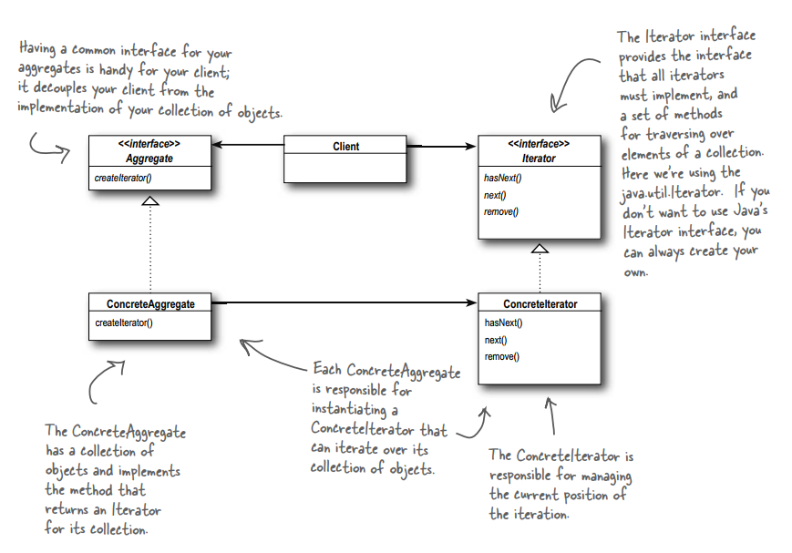
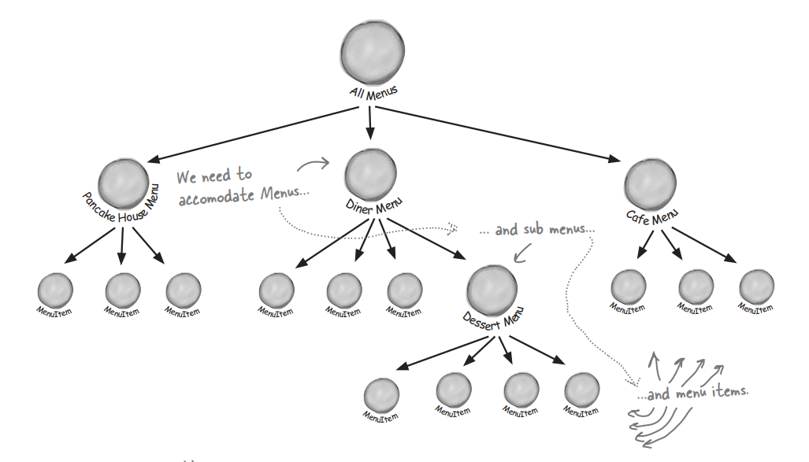
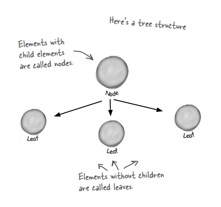
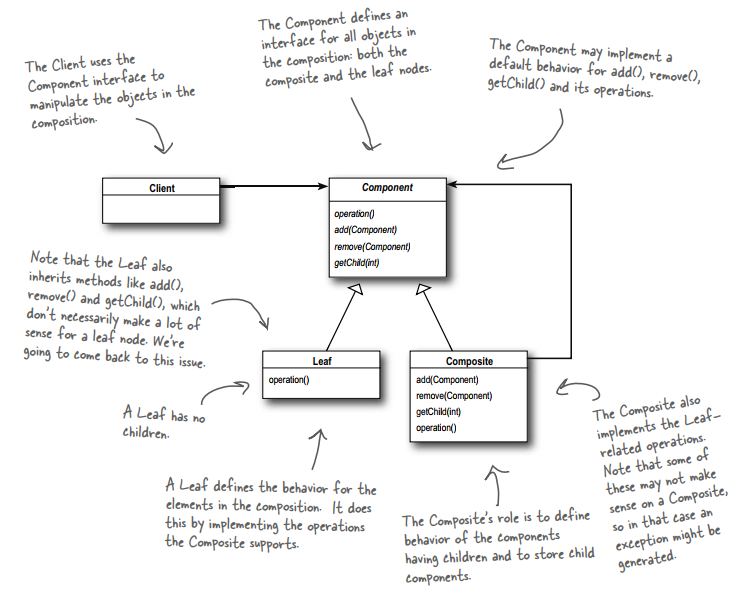

# THE ITERATOR AND COMPOSITE PATTERNS
## Well-Managed Collections
## 1. The Iterator Pattern
### 1.1. The Problem

Objectville Diner and Objectville Pancake House is merging into one business, so they need to integrate their two menu implementations. However, a slight problem occurs.

The Objectville Diner uses an `Array` to store the menu items, while the Objectville Pancake House stores their menu items in an `ArrayList`. Neither of them is willing to change their implementations because they have too much code that depends on those implementations.

How would you help them to solve this problem?

### 1.2. The Definition of Iterator Pattern

**The Iterator Pattern** provides a way to access the elements of an aggregate object sequentially without exposing its underlying representation.

### 1.3. Demo Diagram

## 2. The Composite Pattern
### 2.1. The Problem

Come back to the above menus. They want to make their menus more flexible to contain even sub-menus, not only menu items. See the picture below for a demonstration. How will you structure their code to meet this requirement?

### 2.2. The Definition of Composite Pattern

**The Composite Pattern** allows you to compose objects into tree structures to represent part-whole hierarchies. Composite lets clients treat individual objects and compositions of objects uniformly.

### 2.3. Demo Diagram

