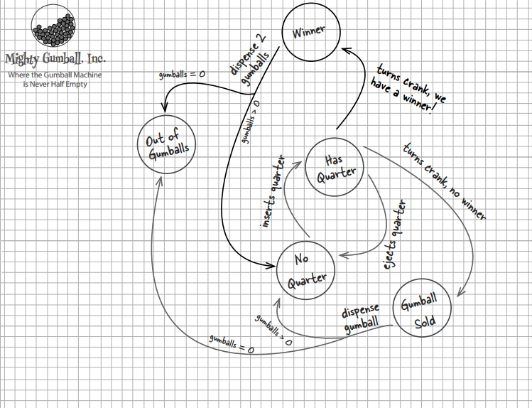
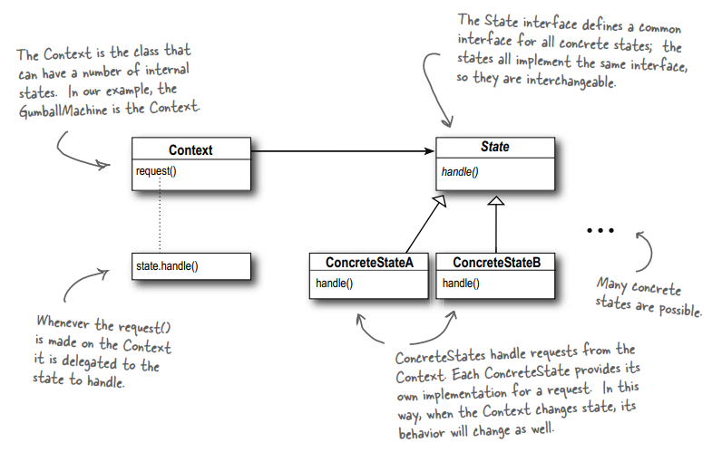

# THE STATE PATTERN
## The State of Things
## 1. The Problem

Mighty Gumball engineers want to put CPUs into their machines to increase sales, monitor inventory over the network and measure
customer satisfaction more accurately. They give you a state diagram describing the states and transitions of their products to get your help developing software for their idea.

How will you help them on this case?

## 2. The Definition of State Pattern

**The State Pattern** allows an object to alter its behavior when its internal state changes. The object will appear to change its class.

## 3. Demo Diagram

