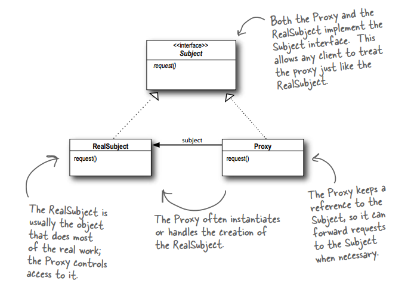
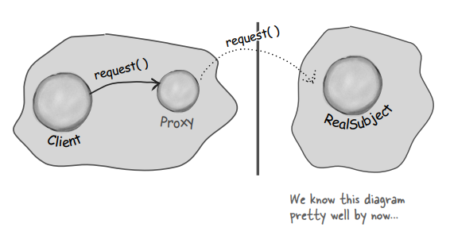
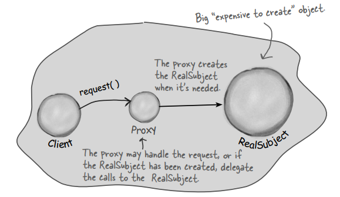
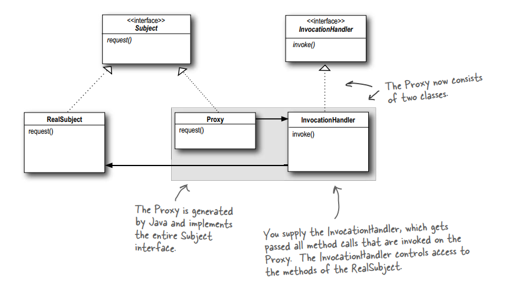

# THE PROXY PATTERN
## Controlling Object Access
## 1. The Definition of Proxy Pattern

**The Proxy Pattern** provides a surrogate or placeholder for another object to control access to it.

## 2. Demo Diagram

## 3. Some variants of the Proxy Pattern
### 3.1. Remote Proxy

With Remote Proxy, the proxy acts as a local representative for an object that lives in a different JVM. A method call on the proxy results in the call being transferred over the wire, invoked remotely, and the result being returned back to the proxy and then to the Client.

### 3.2. Virtual Proxy

Virtual Proxy acts as a representative for an object that may be expensive to create. The Virtual Proxy often defers the creation of the object until it is needed; the Virtual Proxy also acts as a surrogate for the object before and while it is being created. After that, the proxy delegates requests directly to the RealSubject.

### 3.3. Protection Proxy

A Protection Proxy controls access to the methods of an object based on the caller.

