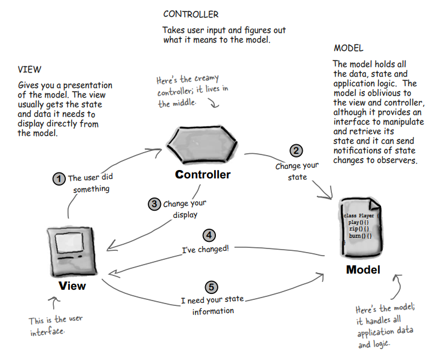

# THE COMPOUND PATTERNS
## Patterns of Patterns
## 1. The Definition of Compound Pattern

**The Compound Pattern** combines two or more patterns into a solution that solves a recurring or general problem.

## 2. The MVC Pattern
### 2.1. Diagram

### 2.2. Explaining the MVC Pattern
- The **model** makes use of the **Observer Pattern** so that it can keep observers updated yet stay decoupled from them.
- The **controller** is the **strategy** for the view. The view can use different implementations of the controller to get different behavior.
- The **view** uses the **Composite Pattern** to implement the user interface, which usually consists of nested components like panels, frames and buttons.
- The **Adapter Pattern** can be used to adapt a new model to an existing view and controller
